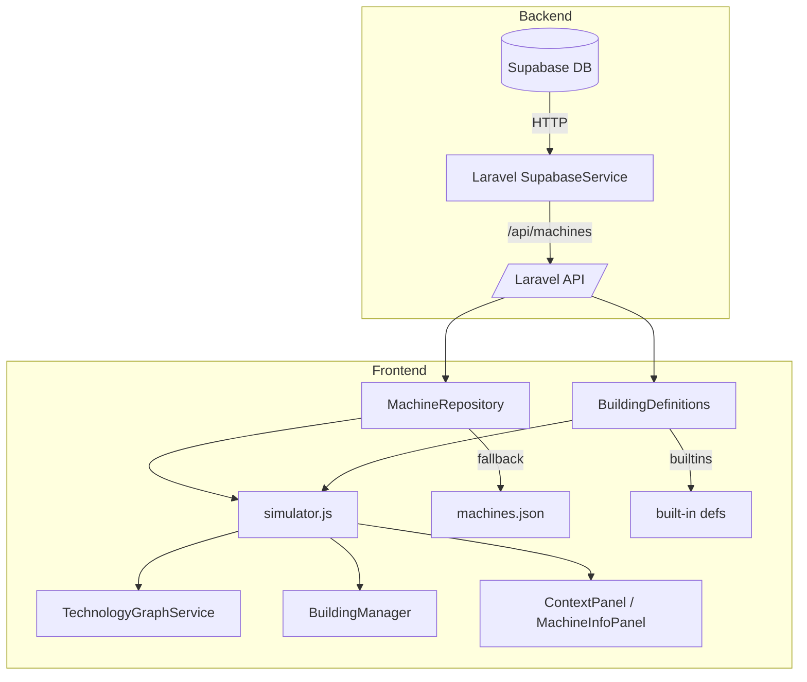
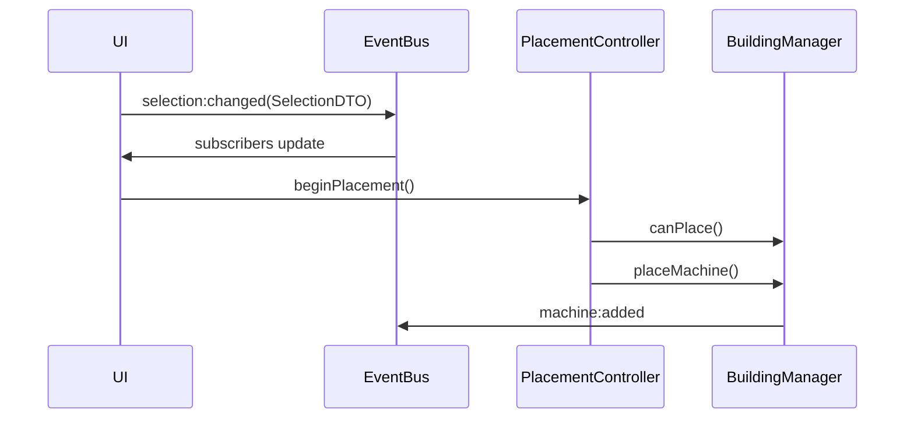
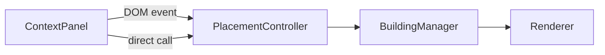

# CURRENT_SYSTEM — Simulator (runtime baseline)

This document describes how the simulator currently works in this repository (truth from the codebase). It is a factual snapshot: it records existing behaviour, legacy paths, and known duplication. It does not prescribe future refactors (those are in ARCHITECTURE.md/MACHINE_DATA_SCHEMA.md).

## 1. Current system overview

- Backend:
  - Supabase is the engineering data store (canonical engineering rows). (server-side adapter: [app/Services/SupabaseService.php](app/Services/SupabaseService.php)).
  - Laravel exposes a small API that proxies Supabase: `/api/machines`, `/api/machines/{id}`, `/api/resources`. (routes: [routes/api.php](routes/api.php)).

- Frontend (resources/js):
  - Entry: Vite builds `resources/js/simulator.js` into `public/build` and the simulator Blade view loads the bundle. (see `resources/js/simulator.js`).
  - Main scene/bootstrap: `resources/js/simulator.js` instantiates game managers, UI panes, `BuildingDefinitions`, `MachineRepository`, and wires `TechnologyGraphService`.
  - Managers & controllers: `BuildingManager` (world-state), `ConnectionManager`, `PlacementController`, and other scene classes (see `resources/js/simulator/managers` and `resources/js/simulator/controllers`).
  - Services: `TechnologyGraphService` (graph queries), repositories: `MachineRepository` and `ResourceRepository`, data module: `BuildingDefinitions`.
  - UI panels (DOM): `ContextPanel.js`, `MachineInfoPanel.js`, toolbox area mounted into `#toolbox-body` (DOM). Some DOM building still happens inside `simulator.js`.

## 2. Current data flow (machines)

Trace: Supabase → Laravel API → Frontend fetch → in-memory consumers.

Step-by-step (files/methods, shapes, behavior):

1) Supabase (authoritative source)
   - File: [app/Services/SupabaseService.php](app/Services/SupabaseService.php)
   - Methods: `getMachines()` / `getMachine($id)` / `getResources()`
   - Input: Supabase REST responses (joined relations: `machine_resources`, `resources`, etc.)
   - Output: Normalized PHP arrays. `getMachines()` returns array of machines where each machine has a `resources` array built from `machine_resources` (see `getMachines()` normalization). (file evidence: `getMachines()` block in [app/Services/SupabaseService.php]).
   - Field renaming: Normalizes `machine_resources` into `resources[]` entries and converts booleans and numeric fields to expected scalar types.
   - Fallback behavior: none (server logs and rethrows on HTTP error).
   - Ownership: Supabase/Laravel own engineering data.

2) Laravel controllers expose the data
   - Files: [app/Http/Controllers/MachineController.php](app/Http/Controllers/MachineController.php), [app/Http/Controllers/ResourcesController.php](app/Http/Controllers/ResourcesController.php)
   - Methods: `index()` -> returns `SupabaseService::getMachines()` JSON at `/api/machines`; `show($id)` -> returns `getMachine($id)` at `/api/machines/{id}` (numeric id only).
   - Field renaming: none beyond SupabaseService normalization.

3) Frontend fetch points (direct client calls)
   - `resources/js/simulator/data/MachineRepository.js` uses `fetch('/api/machines')` and returns raw JSON when available; fallback to `resources/data/machines.json` and then to builtin empty array. (See file: MachineRepository.loadAll).
   - `resources/js/simulator/data/ResourceRepository.js` uses `fetch('/api/resources')` and falls back to `[]` if unavailable.
   - `resources/js/simulator/data/BuildingDefinitions.js` also calls `fetch('/api/machines')` during `init()`; it merges API records into built-in `_defs` and schedules a background refresh. (See BuildingDefinitions.init and _mergeDefs).
   - `resources/js/simulator.js` calls `fetch('/api/machines/'+id)` when showing per-machine details in `showMachineInfoFor()`.
   - Input shapes: the JSON returned by Laravel controllers (arrays of machines or a single machine object shaped by SupabaseService normalization).
   - Output shapes: the files above pass these raw shapes along (MachineRepository returns array, BuildingDefinitions merges into its `_defs` objects and writes canonical-looking objects into `_defs` under many keys).
   - Fallbacks: MachineRepository -> machines.json -> builtin; BuildingDefinitions also falls back to repo/builtin and performs merges even from background fetch.

4) BuildingDefinitions.js
   - File: [resources/js/simulator/data/BuildingDefinitions.js]
   - Method: `init()` fetches API results then merges with builtin `_defs` using `_mergeDefs()`; it creates aliases for id, defKey, stable_key and camelCase variants.
   - Output: `this._defs` (map of keys → canonical merged object) and `this._machines` (raw machine array from API/local JSON).
   - Field renaming & alias creation: stores canonical object under numeric id, `m.defKey`, `m.stable_key`, and a camelCase variant of `stable_key`.

5) simulator.js and TechnologyGraphService
   - `simulator.js` uses `BuildingDefinitions` and `MachineRepository` results to instantiate `TechnologyGraphService({ machines })` and to populate toolbox/context panels.
   - `TechnologyGraphService` (consumer) expects `machines` with `resources[]` entries; it does graph queries (getInputsForMachine/getOutputsForMachine/getMachinesAcceptingResource).

6) BuildingManager and placed machines
   - `BuildingManager.placeMachine()` consumes a `def` (builtin or API-backed merged def) and creates a placed instance with instance id (e.g. `machine-42`) and grid coordinates. Placed instances are stored in the world-state.

7) UI consumers
   - `MachineInfoPanel` and `ContextPanel` read from `BuildingDefinitions` or repo-provided arrays; they show machine inputs/outputs and allow placement. `MachineInfoPanel` will attempt to load resources via `ResourceRepository` and otherwise synthesize minimal fallback resource objects.

Engineering-data ownership notes
   - Supabase (via Laravel) is the only authoritative engineering source in this snapshot. However, the frontend routinely falls back to `machines.json` and builtin `_defs`, and `BuildingDefinitions` merges API fields into those builtins — creating a mixed ownership during runtime.

## 2b. Current data flow (resources)

1) Supabase → `SupabaseService::getResources()` → Laravel `/api/resources` (ResourcesController@index).
2) Client side: `ResourceRepository.loadAll()` calls `fetch('/api/resources')` and returns array; fallback is `[]`.
3) `MachineRepository` and `BuildingDefinitions` also receive resource info embedded inside machine records returned by `/api/machines` (Supabase joined selects include resources). `TechnologyGraphService` can examine `m.resources[]` entries for compatibility.
4) `MachineInfoPanel` attempts to load resource details via `ResourceRepository` when the user clicks a resource; if repository returns no data it synthesizes `{ stable_key, name }` minimal object as fallback.

## 3. Current machine identity flow

Identities currently used across the codebase:
- Numeric DB ID (e.g. `1003`)
- `stable_key` / snake_case (e.g. `anaerobic_digester`)
- `defKey` (legacy def key in machines.json / builtins, e.g. `anaerobicDigester` or `anaerobicDigester` depending)
- camelCase alias produced by `BuildingDefinitions` for `stable_key` (e.g. `anaerobicDigester`)
- placed instance id (e.g. `machine-42` or `instance-42` as created by `BuildingManager`)

Where each form is created, translated and consumed (evidence):
- Supabase rows include numeric `id` and `stable_key` (server-side normalization: [app/Services/SupabaseService.php]).
- Laravel API returns `stable_key`/`id` to the client unchanged.
- `BuildingDefinitions.init()` takes API record `m` and writes `this._defs[id] = canonical; this._defs[m.defKey] = canonical; this._defs[m.stable_key] = canonical; this._defs[camelCase] = canonical;` (see code in `init()` -- alias creation).
- Other consumers: `TechnologyGraphService` finds machines by `stable_key` or `defKey` (it populates `_machinesByStable` from `m.stable_key` and `m.defKey`).

Worked example: `anaerobic_digester`
1. Supabase row: `id = 1003`, `stable_key = "anaerobic_digester"` (server record). (See [resources/data/machines.json] example id 1003 defKey anaerobicDigester)
2. Laravel API: returns a machine object with `id:1003, stable_key:"anaerobic_digester", ...` (via MachineController::index -> SupabaseService::getMachines()).
3. `MachineRepository.loadAll()` fetches `/api/machines` and may return the array with that machine.
4. `BuildingDefinitions.init()` merges the API record into `_defs` and writes aliases:
   - `_defs['1003'] = canonical`
   - `_defs['anaerobic_digester'] = canonical`
   - if `defKey` present, `_defs['anaerobicDigester'] = canonical`
   - camelCase alias `_defs['anaerobicDigester']` too (code creates camel conversion of stable_key).
5. When placed, `BuildingManager.placeMachine()` creates an instance id such as `machine-42` stored in world state and emits `machine:added`.

Thus the same machine may be referenced in code by numeric id (`1003`), stable_key (`anaerobic_digester`), camelCase alias (`anaerobicDigester`), defKey, or by placed instance id (`machine-42`). This multiplicity is widespread in `BuildingDefinitions`, `MachineRepository`, and usage sites.

## 4. Current boot sequence (numbered)
1. Browser loads Blade view (simulator route) which includes Vite-generated JS bundle.
2. `resources/js/simulator.js` (Vite entry) executes: constructs `BuildingDefinitions`, `MachineRepository`, `TechnologyGraphService`, managers and UI panels.
3. `BuildingDefinitions.init()` attempts `fetch('/api/machines')` (immediate). If empty, it calls `MachineRepository.getAll()` (which itself tries `/api/machines` then `machines.json`), then merges results into `_defs` and schedules a background refresh to re-fetch `/api/machines` and overlay API fields.
4. `MachineRepository.loadAll()` tries `/api/machines` -> `resources/data/machines.json` -> builtin fallback.
5. When machines are available `simulator.js` instantiates `TechnologyGraphService({ machines })`, mounts `ContextPanel` into `#toolbox-body`, creates Phaser scene and managers, and wires EventBus listeners.
6. UI panels (`MachineInfoPanel`, `ContextPanel`) are mounted and subscribe to `selection:changed` and other events.
7. Initial rendering: some built-in sources (e.g. farmWaste) are created from `BuildingDefinitions._defs` and demo scenario supplies are loaded from `DemoScenarioData.js`.

## 5. Current selection flow

A) Clicking a placed machine
- Origin: Phaser sprite click handler (scene code in `resources/js/simulator/*`), calling `EventBus.emit('selection:changed', { type:'machine', instanceId, stableKey })` or direct manager selection.
- Payload: selection DTO with `type: 'machine'`, `instanceId` (e.g. `machine-42`), `stableKey` when available.
- Subscribers: `ContextPanel`, `MachineInfoPanel`, `simulator.js` listeners.
- UI effect: `MachineInfoPanel.show()` renders machine details; `ContextPanel` shows compatible machines.
- Failure cases: placed sprite may not carry `stableKey` if created from legacy builtin; inconsistent stableKey presence can cause UI to show fallback minimal info.

B) Clicking a decorative resource sprite
- Origin: decorative sprites in Phaser were created for visuals but not always backed by world-state instances; their click handlers synthesize a selection event.
- Event emitted: `selection:changed` with `type: 'resourceSource'` or a minimal selection DTO (sometimes only `resourceStableKey` and no `instanceId`). `MachineInfoPanel` fallback: it may synthesize a minimal `{ stable_key, name }` if `ResourceRepository` has no data.
- Known failure: Decorative sprites are not returned by `BuildingManager.getMachineAt()` because they are not stored in the world-state registry; therefore code that queries world-state for instance data does not find them.

C) Selecting a resource through the resource dialog
- Origin: `MachineInfoPanel` (resource row click) or resource dialog UI.
- Behavior: `MachineInfoPanel` imports `ResourceRepository`, calls `getAll()` to find a full resource record; if none found constructs minimal fallback and emits `selection:changed` with `type:'resourceSource'` and `resourceStableKey`.
- Failure cases: if `ResourceRepository` returns `[]`, UI still proceeds with a minimal object.

D) Clicking empty canvas
- Origin: scene pointer down handler when no interactive object under cursor.
- Event: `selection:changed` with `null` or `{ type:'ground' }` depending on code path.
- UI effect: panels hide/clear selection.

E) Pressing Escape
- Origin: global keyboard handler in simulator UI code.
- Behavior: cancels placement, clears selection, emits `placement:cancelled` or `selection:changed:null`.

F) Deleting the selected object
- Origin: UI command or hotkey handled by `simulator.js`/managers.
- Behavior: `BuildingManager` removes the placed instance, emits `machine:removed`, UI updates accordingly.

## 6. Current placement flow

Flow (high level): UI card → DOM custom event / EventBus → PlacementController → preview → footprint validation → BuildingManager.placeMachine() → selected placed instance → UI update

- ContextPanel/Toolbox card click: `ContextPanel` dispatches a DOM CustomEvent `contextpanel:place` and calls `PlacementController.beginPlacement()` directly in some code paths.
- PlacementController: handles preview sprite, pointer movement, pointer down to place. Emits `placement:started` and on completion `placement:completed`.
- Footprint validation: `PlacementController` calls `BuildingManager.canPlace()` which checks occupancy map.
- On success: `BuildingManager.placeMachine()` creates placed instance, assigns instanceId, stores in world state, and triggers `machine:added`.

Direct calls vs DOM events:
- Both are used: `ContextPanel` emits DOM custom events (e.g. `contextpanel:place`) and also invokes placement controller methods directly where available.

## 7. Current connection flow (Power / Water / Gas / Conveyor)

Shared pattern:
 - Tool selection sets a current tool mode in `simulator.js` / UI.
 - User clicks source instance → sets selection to connection source.
 - User clicks target instance → code validates compatibility using `TechnologyGraphService` and `BuildingManager` connection rules.
 - `ConnectionManager` (or similar) creates a connection object in world-state and renderer draws the link.

Duplication:
 - Validation logic exists in `ConnectionManager` and also in UI-side filters (ContextPanel/toolbox) which replicate some checks. `TechnologyGraphService` is used for compatibility, but callers sometimes reimplement checks.

## 8. Current annual-flow calculation

Flow path:
 - `resources/js/simulator/data/DemoScenarioData.js` supplies placeholder scenario values (e.g. `farm_waste` annualAvailable).
 - When a source or machine is selected, `MachineInfoPanel` uses `FlowConnectionResolver` and `AnnualFlowCalculator` (tests exist under `tests/`) to compute flows.
 - Values used:
   - Supabase: engineering fields (if loaded) such as `annual_capacity` when present in API records.
   - DemoScenarioData: supply numbers used for source availability and example calculations.
   - Built-in definitions: `BuildingDefinitions._defs` may provide fallback footprint/accepts/provides used for compatibility checks.
   - Connection state: placed connections and machine placements determine actual routed flows.

## 9. Current UI ownership

- Toolbox: historically built by `simulator.js`; new `ContextPanel` is mounted into `#toolbox-body` but legacy toolbox code still coexists. (See `simulator.js` and `resources/js/simulator/ui/ContextPanel.js`).
- `ContextPanel`: `resources/js/simulator/ui/ContextPanel.js` — DOM UI for context-aware toolbox, dispatches `contextpanel:place` and sometimes calls `PlacementController`.
- `MachineInfoPanel`: `resources/js/simulator/ui/MachineInfoPanel.js` — shows details, resource rows click behavior attempts to load `ResourceRepository`.
- Operations Centre / status bar: various files under `resources/js/simulator/ui` (ownership partially in `simulator.js`).
- Resource dialog: implemented in UI files, but `MachineInfoPanel` engages its selection logic.

DOM creation inside `simulator.js`:
 - `simulator.js` still builds / mounts some DOM components and wires event handlers (see code around toolbox mounting and EventBus wiring).

## 10. Current global coupling

- `window.__simulatorScene` usages: present in codebase as a debug / cross-scope shortcut (search required for exact count). When used it allows UI code to call into scene or managers directly. This is production glue and creates tight coupling between DOM and Phaser internals.
- DOM CustomEvent usage: `ContextPanel` uses `dispatchEvent(new CustomEvent('contextpanel:place', { detail }))` and UI listens in other parts.
- Direct manager calls from UI: some UI invokes `PlacementController.beginPlacement()` directly rather than emitting events.
- Direct fetch calls: multiple client modules call `fetch('/api/...')` (MachineRepository, BuildingDefinitions, ResourceRepository, simulator.js showMachineInfoFor).

## 11. Current sources of truth (summary table)

| Source | What it owns | Authoritative? | Legacy? | Where read | Conflicts created |
|---|---:|---:|---:|---|---|
| Supabase (via Laravel) | machines, machine_resources, resources rows | Yes (intended) | No | [app/Services/SupabaseService.php], controllers | None if frontend used it exclusively |
| Laravel API `/api/*` | Proxy of Supabase normalized JSON | Yes (proxy) | No | MachineRepository, BuildingDefinitions, simulator.js | None if single client used |
| resources/data/machines.json | Local sample machine records | No | Yes | MachineRepository fallback | Conflicts with API if both differ |
| BuildingDefinitions._defs | Renderer metadata + merged API fields | No (renderer first) | Yes | BuildingDefinitions, simulator.js | Merges API fields into builtins causing mixed ownership |
| simulator built-in arrays | Some hard-coded machine defs | No | Yes | simulator.js, older code | May disagree with Supabase fields |
| DemoScenarioData.js | Placeholder scenario numbers | No | Yes | MachineInfoPanel, calculators | Can produce demo-only flows conflicting with real data |
| Placed-world state | Instance placement/positions/connections | Yes for runtime world | No | BuildingManager | Not conflicting — but depends on canonical defs for behavior |

## 12. Current dependency diagrams

### A. Data flow (mermaid)

### B. Selection / Event flow

### C. Placement flow

## 13. Current-system summary

- Strong reusable components:
  - `TechnologyGraphService` (pure graph queries; reusable)
  - `PlacementController` / `BuildingManager` (clear world-state responsibilities)
  - `SupabaseService` (server-side canonical adapter)

- Most fragile components:
  - `simulator.js` (god-object, holds mixed responsibilities)
  - `BuildingDefinitions` (merges engine and renderer metadata + creates aliases)
  - Multiple direct `fetch()` call sites and silent fallbacks

- Highest-risk dependencies:
  - `window.__simulatorScene` (tight coupling)
  - Client-side fallback to `machines.json` and builtins during normal startup

- Code that should not be changed first:
  - Server-side `SupabaseService.php` and API controllers — they expose canonical data.
  - `BuildingManager` world-state code while refactoring placement flows.

- Code safe to isolate first:
  - `MachineRepository`, `ResourceRepository`, `BuildingDefinitions` (can be isolated behind a DataLoader), `ContextPanel` (UI layer).

---
End of CURRENT_SYSTEM.md
